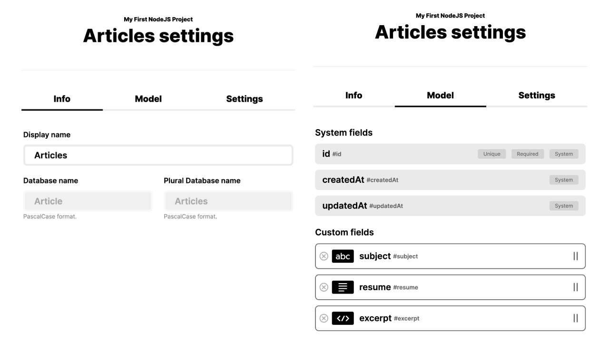

<p align="center">
  
  <br /> <br /> <br />
</p>

<h1 align="center">Tutorial GraphQL Apirocket</h1>

<p align="center">The tool used by the world's laziest web developers to create their GraphQL API</p>

<p align="center">
  <a title="MIT License" href="LICENSE.md">
    
  </a>
  <a title="Twitter: JoseJ_PR" href="https://twitter.com/JoseJ_PR">
    
  </a>  
  <a title="Github: Sponsors" href="https://github.com/sponsors/JoseJPR">
    
  </a>
  <br />
  <br />
</p>

## 🔖 Description

For this tutorial you need to create a user account on the platform https://www.apirocket.io/

You can create collections in GraphQL and interact with them in a Dashboard. In this tutorial we have used a collection with the following structure:

<p align="center">
  
</p>

## 📌 Methodologies and Guidelines

Quality Assurance Code (QAC)

* ESTlint, tool for identifying and reporting on patterns found in ECMAScript/JavaScript code. \
  [NPM ESLint](https://www.npmjs.com/package/eslint) \
  [NPM ESLint | Airbnb](https://www.npmjs.com/package/eslint-config-airbnb)

## ✅ Prerequisites

In order to work with this project, your local environment must have at least the following versions:

* NodeJS Version: 14.xx
* NPM Version: 6.14.7

## 📐 How to work with this project

### 1️⃣ Add the enviroments files
Create and add .env file into the main folder of this project. You can see the schema of this file here "env/.env.schema", for example:
```any
# -------- CONFIGURATION NODEJS PROJECT ------------------
NODE_ENV=DEV
# --------------------------------------------------------

# -------- CONFIGURATION APIROCKET CONNECTION ------------
APIROCKET_HOSTNAME=graphql.apirocket.io
APIROCKET_API_TOKEN=1234567890
# --------------------------------------------------------
```

### 2️⃣ Install NodeJS Dependencies
Install project dependencies.
```bach
$npm i
```

### 3️⃣ Run Application
Execute the follow sentence for run this application. 
```bach
$npm run start
```

## 📂 Code scaffolding

```
/
├── assets 🌈               # Images Sources.
├── env 🔌                  # Enviroments.
├── src 💯                  # Main NodeJS Application.
└── ...
```

## ⛽️ Review and Update Dependences

For review and update all npm dependences of this project you need install in global npm package "npm-check-updates" npm module.

```bash
# Install and Run
$npm i -g npm-check-updates
$ncu
```

## License

[MIT](LICENSE.md)

## Happy Code

Created with JavaScript, lot of ❤️ and a few ☕️

## This README.md file has been written keeping in mind

- [GitHub Markdown](https://guides.github.com/features/mastering-markdown/)
- [Emoji Cheat Sheet](https://www.webfx.com/tools/emoji-cheat-sheet/)
